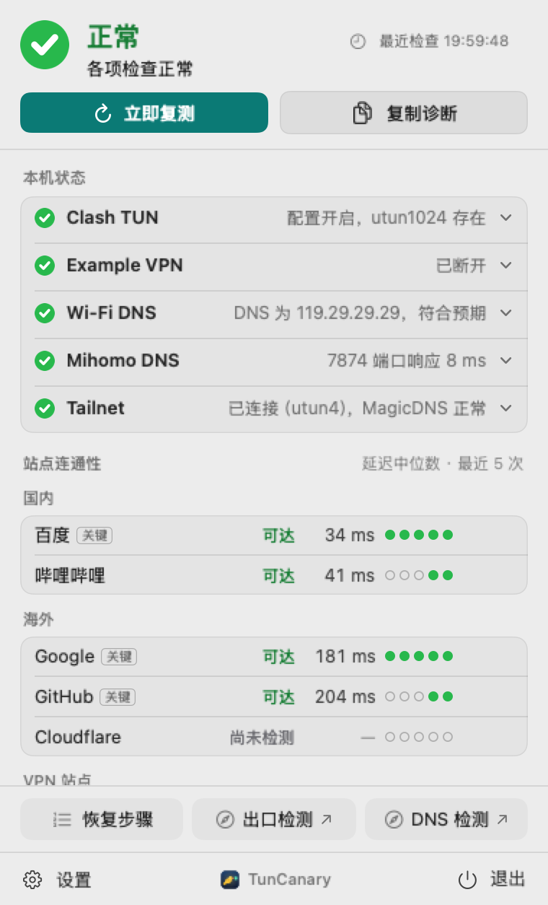
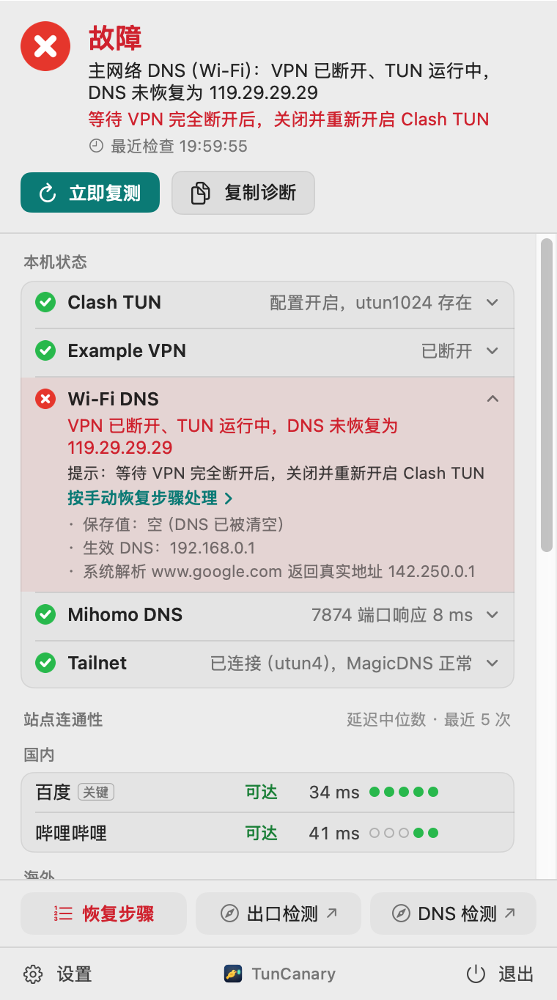
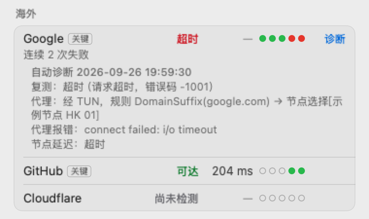

# TunCanary

[English](README.en.md)

TunCanary 是一个 macOS 菜单栏应用。代理的 TUN、VPN 和 Tailscale 等隧道同时存在时，它检查本机网络有没有悄悄出错。最主要的一项检查是系统 DNS 有没有绕过 Clash 类代理的 TUN。

<p align="center">
  <picture><source media="(prefers-color-scheme: dark)" srcset="docs/images/popover-ok-dark.png"></picture>
  <picture><source media="(prefers-color-scheme: dark)" srcset="docs/images/popover-dns-critical-dark.png"></picture>
</p>

<p align="center">左：各项正常；右：VPN 断开后 DNS 没有恢复，DNS 查询绕过了代理。截图使用虚构数据。</p>

## 适用场景

TunCanary 假定你用 Clash 类代理的 TUN 模式统一管理本机网络：代理、VPN 和 Tailscale 等多条路径同时存在，由 TUN 和代理规则决定流量走哪条。只用一路代理或者只用一个 VPN 时，环境简单，一般不需要它。

TUN 关闭是正常状态，不算故障。这时代理 TUN 卡显示“配置关闭”，其他检查照常运行，只跳过依赖 fake-ip 的判断。

## 它解决的问题

Clash 类代理开启 TUN 并使用 fake-ip 模式时，系统解析任何域名都应该拿到 fake-ip，也就是配置中 `fake-ip-range` 网段内的地址（常见的是 `198.18.0.1/16`）。如果拿到的是真实 IP，说明这次 DNS 查询没有经过代理。

这种情况常出现在同时使用 VPN 的时候：VPN 客户端连接时改写了网络服务的 DNS，断开后没有恢复成原来的值，DNS 查询于是直接发给了局域网里的路由器。网站照样能打开，只看连通性发现不了，但 DNS 已经泄露到代理之外。

TunCanary 每隔一段时间用系统解析器查询一个“探针”域名，返回真实 IP 就判为故障，并发出系统通知。

## 检查的内容

| 状态卡 | 检查 |
| --- | --- |
| 代理 TUN | 代理配置里 TUN 是否开启、fake-ip 网段内是否有 UP 的 utun 接口、核心进程是否在运行 |
| VPN | 按你编写的适配器配置识别 VPN 进程、隧道和路由；另外报告未识别的隧道。证据互相矛盾时判为“未确认” |
| 主网络 DNS | 系统解析探针域名是否返回 fake-ip；可选：检查网络服务保存的 DNS 是否符合你设定的规则 |
| 代理 DNS | 代理在本机监听的 DNS 端口是否响应 |
| Tailnet | 只在有 Tailscale 隧道或配置了 Tailnet 子网目标时出现。检查 tailnet 路由是否经过 Tailscale 隧道、MagicDNS 能否把本机名称解析回本机地址，以及 Tailnet 子网目标走哪条路由 |

此外还会分组检测一组站点的可达性（默认是百度、哔哩哔哩、Google、GitHub 和 Cloudflare）。后台默认每 2 分钟检测一轮，连续三轮失败时告警。开启“站点失败时诊断代理”后，诊断结果显示在站点行下方，说明这次访问命中了哪条规则、经过哪个节点：

<p align="center"><picture><source media="(prefers-color-scheme: dark)" srcset="docs/images/proxy-diagnosis-dark.png"></picture></p>

颜色含义：绿色正常，黄色需关注，红色故障，灰色表示证据不足或未确认。状态未确认时不给修复建议，也不发通知。Tailnet 卡的灰色（例如人就在子网所在的局域网里，网段相同）只表示这个场景无法判断，不影响整体结论和命令行退出码。

### Tailnet 卡

| 情况 | 判定 |
| --- | --- |
| MagicDNS 地址或 `100.64.0.0/10` 的路由没有指向 Tailscale 隧道 | 红 |
| Tailnet 子网目标经默认路由、代理 TUN 或其他隧道出去，也就是子网路由没有生效 | 红 |
| Tailnet 子网目标经 Tailscale 隧道，TCP 连接连续三轮失败 | 红，显示在站点列表的“Tailnet 子网”一行 |
| MagicDNS 不应答，或者系统把 MagicDNS 名称解析成 fake-ip、别的地址或解析失败 | 黄 |
| Tailnet 子网目标在当前网络的网段内（人就在子网所在的局域网里，或所在网络恰好同网段） | 灰，不探测 |
| 配置了目标，但 Tailscale 未连接 | 灰，不探测 |

TCP 探测只建立连接，不发送数据。连接建立或者端口拒绝连接，都说明路径可达。

## VPN 与常驻隧道

TunCanary 把隧道分成两类，处理方式不同：

| | VPN | 常驻隧道（例如 Tailscale） |
| --- | --- | --- |
| 使用方式 | 按需连接和断开，连接时常会改写网络服务的 DNS | 长期保持连接，只负责自己的网段和域名 |
| 识别方式 | 按你编写的适配器配置识别，见 [docs/ADAPTERS.md](docs/ADAPTERS.md) | 自动识别：地址在 `100.64.0.0/10` 内的 utun 视为疑似 Tailscale |
| 是否参与判定 | 参与。VPN 是否连接决定主网络 DNS 按哪条规则检查 | 不参与 VPN 判定，由 Tailnet 卡单独检查 |

不要为 Tailscale 这类常驻隧道编写 VPN 适配器。适配器会让 TunCanary 一直认为 VPN 已连接，VPN 断开时的 DNS 规则就不再生效。DNS 守护进程也不会修改 Tailscale 这类 VPN 类型的网络服务。

## 系统要求

- macOS 13 或更新版本。
- Xcode Command Line Tools，包含 Swift 5.10 或更新版本。不需要完整的 Xcode。

没有第三方依赖。

## 构建与安装

在仓库根目录运行：

```sh
scripts/test.sh
scripts/build-app.sh
scripts/install.sh
```

- `test.sh` 运行离线测试，不访问网络。
- `build-app.sh` 生成 `build/TunCanary.app`，并做 ad-hoc 签名。
- `install.sh` 把应用安装到 `~/Applications/TunCanary.app`，写入命令行入口 `~/.local/bin/tuncanary`，然后启动应用。它不会开启登录时启动。

本机构建的应用不带隔离属性，Gatekeeper 不会拦截。目前不提供预构建的安装包。

卸载：

```sh
scripts/uninstall.sh                  # 保留设置
scripts/uninstall.sh --clear-settings # 一并删除设置
```

## 配置

点击菜单栏图标，再点弹窗底部的“设置”。设置分三栏：“站点”放公开站点、VPN 站点、Tailnet 子网目标、出口检测目标和检测页；“代理与 DNS”放代理客户端、DNS 规则和探针域名；“通用”放检测频率、通知、登录时启动和 VPN 适配器。有错误的栏会显示红点。

- **代理客户端**：选择 Clash Verge Rev 时，应用读取它的配置文件，只取 TUN 开关、DNS 端口、IPv6 开关、fake-ip 网段（含 IPv6 网段）和 fake-ip 过滤名单，不读 secret 和节点。其他客户端选“手动填写”，填 fake-ip 网段；代理 DNS 端口和核心进程名可选。
- **站点失败时诊断代理**：默认关闭，只支持 Clash Verge Rev。开启后，站点首次失败或失败类型变化时，应用复测一次，同时订阅 mihomo 的日志，找到这次访问命中的规则和出站节点；复测仍失败且经过节点时，再对节点测一次延迟。站点行上的“诊断”按钮可以随时手动诊断。结果显示在站点行下方和诊断摘要中，不参与判定，也不单独通知。
  - 控制接口是 Clash Verge Rev 服务启动核心时指定的本机 socket（例如 `/var/run/clash-verge-service/users/<uid>/verge-mihomo.sock`），归当前用户所有，不需要 secret。应用从 `verge-mihomo` 的启动参数中读取它的路径。
  - 失败说明里会附带错误码；TLS 错误还附带底层错误码和服务器证书的主题，用来区分证书问题和连接被中断。
- **探针域名**：默认 `www.google.com`。它不能在代理的 fake-ip 过滤名单中，否则系统解析本来就返回真实 IP。应用会读取 Clash Verge Rev 的过滤名单并提示。
- **DNS 规则**：可选。可以规定 VPN 断开、TUN 运行时网络服务保存的 DNS 应该是什么（不检查、指定地址或为空），以及 VPN 连接时的规则（不检查、VPN 下发的 DNS，或由代理接管）。选“由代理接管”时，VPN 连接期间也按断开时的规则检查，并要求系统解析经过代理；VPN 域名须由代理解析。系统解析确认经过代理时，设置页会出现“用当前值作为预期”按钮。
- **VPN 适配器**：见 [docs/ADAPTERS.md](docs/ADAPTERS.md)。不配置也能用：核心检测不依赖 VPN。
- **站点**：最多 20 个，可以分组，可以选择哪些参与后台检测和告警。“添加常用站点”里有更多预置站点。
- **VPN 站点**：一个只在 VPN 已连接时探测的 URL。诊断摘要里只显示“已配置”或“未配置”。
- **Tailnet 子网目标**：Tailnet 子网里一台常开设备的 `IPv4 地址:端口`，例如 `192.168.1.10:443`。只在它经 Tailscale 子网路由访问时做 TCP 连接探测。第一次探测时，系统可能请求“本地网络”权限；拒绝后该行显示“未获得本地网络权限”，不计为失败。诊断摘要和 JSON 里只显示“已配置”或“未配置”。
- **出口稳定性监测**：模块始终显示各目标的出口 IP，各目标详情默认收起，点击对应行可独立展开；关闭弹窗后重置，后台采样不受影响。应用运行且系统唤醒时，默认每 5 分钟采样一次。间隔可设为 5 至 1440 分钟，后台请求按目标错开；手动检测立即触发并写入历史，不受自动间隔限制，也不推迟下一次自动检测；服务端限流冷却仍生效。主页显示实测 IP、地域、上次采样时间、30 天内变化次数和本机历史。IPv4 与 IPv6 分开比较。失败、休眠或采样中断会打断“采样未见变化”的时段，两次采样之间的短暂变化可能漏检。
- **出口检测目标**：Cloudflare 始终启用。Claude、ChatGPT 和字节检测 CDN 可分别启用，另可加入最多 5 个自定义目标。Cloudflare、Claude、ChatGPT 和自定义 Cloudflare 域名使用 `/cdn-cgi/trace`；字节目标向 `perfops.byte-test.com` 发出 HEAD 请求，从响应头读取出口 IP。普通域名可配置 HTTPS 回显接口，选择响应头（HEAD）或 JSON 字段（GET，例如 `data.ip`）。接口须返回有效 IP；应用不会从任意网页推测出口。各目标记录的是本应用访问该接口时的出口。旧淘宝 IP 库为非公开接口，仅支持手动检测。
- **出口地域告警**：每个内置或自定义目标可单独多选允许的国家和地区。常用项为美国、日本、新加坡、中国台湾、中国大陆和中国香港，也可搜索完整地域列表。不选择时只记录；连续两次有效采样越界才通知，持续越界不重复通知，恢复时通知一次。IP 变化默认只记录，可单独开启通知；通知仍受“通用”栏的总开关控制。地域查询失败、缓存过期或来源冲突时显示未确认，不触发新的地域告警。
- **出口请求退避**：429 按 `Retry-After` 冷却，其他失败逐步延长间隔。403 或安全挑战页会暂停对应目标，须在主页点“恢复”。应用不携带浏览器登录 Cookie，也不跟随重定向。
- **检测页**：最多 3 个在浏览器中打开的外部检测页，默认没有。

## 命令行

```sh
tuncanary --check          # 一次本机检查和一轮轻测
tuncanary --check --full   # 完整检测全部站点
tuncanary --check --json   # 输出 JSON
tuncanary --version        # 打印版本号
```

退出码：`0` 正常，`1` 需关注，`2` 故障，`3` 未确认，`64` 参数错误。黄色或红色的本机结论会在 10 秒后复查一次，两次一致才报告。整体超时 30 秒。

JSON 的键名和取值会在后续版本中保持兼容。新版本只会新增键，例如 0.3.0 新增了 `tailnet`（Tailnet 子网的探测状态）和 `kind` 为 `tailnet` 的状态项。

## DNS 守护进程（可选）

菜单栏应用只报告问题，不修复。DNS 守护进程是单独安装的可选组件，默认不安装。它以 root 身份运行，在代理 TUN 运行时把主网络服务保存的 DNS 改成你指定的目标值，让查询回到代理。

它分两个阶段工作：

| 阶段 | 条件 | 默认 |
| --- | --- | --- |
| 断开期 | TUN 运行，VPN 已断开，保存的 DNS 不是目标值 | 开启 |
| 连接期 | TUN 运行，VPN 已连接，保存的 DNS 不是目标值，并且代理能解析你指定的 VPN 探针域名 | 关闭 |

开启连接期之前，先确认代理能把 VPN 域名交给 VPN 的 DNS 解析。否则改写之后，VPN 域名会解析失败。

守护进程的行为：

- 由 LaunchDaemon 启动：系统网络配置变化时运行一次，另外每 30 秒运行一次。每次运行完成一次判定后退出。
- 两次采样，间隔 3 秒。两次都满足条件才写入，VPN 正在切换或状态未确认时不写。遇到切换时，同一次运行里每 5 秒重新采样，最多 3 次，切换一结束就能写入。连接期的 VPN 探针查不到时，同样每 5 秒重查，最多 3 次。
- 靠 VPN 适配器判断 VPN 状态。没有适配器或适配器配置无效时不写入。
- 只改主网络服务保存的 DNS 服务器列表，保留 DNS 设置里的其他键。只改允许的服务类型（默认 Wi-Fi 和以太网），不改 VPN 服务。
- 写入后读回保存值和系统默认解析器，一致才算成功。连续失败 3 次后停 10 分钟。
- 不关闭或重启代理，不修改代理配置、VPN 配置和路由。

先以普通用户构建，再用管理员权限安装：

```sh
scripts/build-app.sh
sudo scripts/install-dns-guard.sh
```

安装脚本把可执行文件、配置和你的 VPN 适配器复制到 `/Library/Application Support/TunCanary/`，再加载 `/Library/LaunchDaemons/io.github.eastcn.tuncanary.dns-guard.plist`。这些文件都归 root 所有，普通用户只能读。

- 目标 DNS 默认取设置中断开期的预期 DNS，要求“VPN 断开、TUN 运行时”为“指定地址”。也可以用 `--target-dns 223.5.5.5` 指定。
- 修改适配器后，重新运行安装脚本，把新的适配器复制过去。已有配置会保留，旧文件先备份。
- 修改配置需要用 `sudo` 编辑 `dns-guard.json`。连接期接管在 `connectedTakeover` 中开启，同时填写 `intranetProbeHost`。

想先看看守护进程会做什么，可以试运行。它只判定，不写入：

```sh
sudo "/Library/Application Support/TunCanary/bin/tuncanary-dns-guard" --dry-run
```

卸载：

```sh
sudo scripts/uninstall-dns-guard.sh
```

卸载会停用守护进程、删除这些文件，但不改回 DNS。卸载后请按当时的状态自己核对保存的 DNS。

安装后，主网络 DNS 卡会显示守护进程是否安装，以及最近一次判定和写入的结果。守护进程的目标 DNS 和设置中的预期 DNS 不一致时，卡片会给出提示。

## 隐私

- 菜单栏应用只读取状态，不修改 DNS、TUN、代理或 VPN 的设置。只有单独安装的 DNS 守护进程会修改网络服务保存的 DNS，见上一节。
- 读取范围：代理配置中的上述字段、相关进程的可执行文件路径、网络接口与路由、SCDynamicStore 中的 DNS 设置、VPN 状态文件中适配器指定的字段，以及 `/Library/Application Support/TunCanary/` 下 DNS 守护进程的配置、状态和事件（守护进程是可选组件，未安装时这些文件不存在）。开启代理诊断后，还会读取 `verge-mihomo` 的启动参数，并在诊断期间订阅代理日志；只取本应用发出的连接记录。
- 网络请求：站点检测、代理 DNS 查询、系统解析探针；有 Tailscale 隧道时，向 MagicDNS（`100.100.100.100`）反查本机地址，并解析得到的本机名称；配置了 Tailnet 子网目标时，对它做 TCP 连接探测；代理诊断会让代理对命中的节点做一次延迟测试。出口监测按配置间隔请求已启用的目标。地域查询向 `ipwho.is/<实测 IP>` 发送完整出口 IP，同一 IP 的地域结果共用 7 天缓存。
- 证据和诊断摘要里不写 MagicDNS 名称和 tailnet 域名。
- 不上传本机历史或遥测。出口目标会看到此次请求的来源 IP，地域服务会收到查询的 IP。诊断摘要、命令行输出和通知都会脱敏：私有 IP 只保留首段，不包含 VPN 站点 URL 和主目录路径。
- 本机写入：故障出现、变化和消失的记录保存在 `~/Library/Application Support/TunCanary/events.jsonl`，最多 200 条，内容同样脱敏，显示在弹窗的“最近事件”和诊断摘要中。`scripts/uninstall.sh --clear-settings` 会一并删除。
- 出口采样和地域缓存单独保存在 `~/Library/Application Support/TunCanary/egress-history.json`，文件仅当前用户可读写。采样记录保留 30 天，启动时及运行期间清理过期数据。历史包含完整出口 IP，不进入诊断摘要、命令行 JSON 或故障事件导出；卸载时加 `--clear-settings` 会删除该文件。

## 局限

- 探针按 IPv4（A 记录）判定，只代表通过系统解析器的查询。浏览器自带的 DoH、应用自己的解析器不在检查范围内。
- 探针也会查询 AAAA 记录，结果只显示在主网络 DNS 卡的证据中，不据此告警。
- 只支持 fake-ip 模式。redir-host 等模式下无法用探针判断绕过。
- ad-hoc 签名的应用重装后，登录时启动可能需要在系统设置中重新批准。
- 界面和文档目前只有中文。

## 许可证

[MIT](LICENSE)。

TunCanary 与 Clash Verge Rev、mihomo、Cloudflare、Anthropic 以及文中提到的其他产品和网站没有关联。
